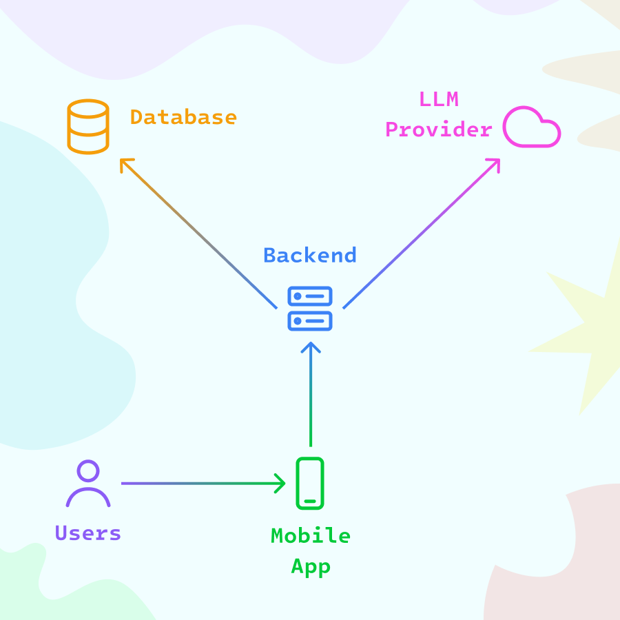

# ДетектИИв

Мобильная детективная игра: игрок изучает дело, допрашивает подозреваемых,
проверяет улики и сдаёт итоговый отчёт. Сервер управляет расследованиями,
хранит игровое состояние и генерирует сценарии и ответы персонажей через LLM.
Публичный сайт знакомит с игрой и содержит документы, необходимые для
публикации в мобильных маркетах.

## Состав проекта



- `mobile/` — Flutter-клиент для Android и iOS.
- `backend/` — Go API, MongoDB-хранилище и интеграция с OpenRouter.
- `website/` — статический сайт на Next.js: лендинг, политика
  конфиденциальности, условия использования, поддержка и удаление данных.
- `backend/api/openapi-v1.yaml` — актуальный контракт HTTP API.

## Требования

- FVM;
- Flutter 3.44.1, установленный через FVM;
- Go 1.25 или новее;
- Node.js 22.13 или новее;
- Docker и Docker Compose для контейнерного запуска;
- доступная MongoDB;
- ключ OpenRouter для генерации игрового контента.

## Быстрый старт

```bash
cp backend/.env.example backend/.env
cd backend
set -a
source .env
set +a
go run ./cmd/server
```

В другом терминале запустите приложение, передав адрес API:

```bash
cd mobile
fvm flutter pub get
fvm flutter run --dart-define=API_BASE_URL=http://localhost:8080
```

Для Android Emulator обычно нужен адрес `http://10.0.2.2:8080`, для iOS
Simulator — `http://localhost:8080`.

Локальный запуск сайта:

```bash
cd website
npm install
npm run dev
```

Сайт будет доступен по адресу `http://localhost:3000`. Для production-сборки:

## Проверки

Проверки перед коммитом:

```bash
(cd backend && go test ./... && go vet ./...)
(cd mobile && fvm flutter analyze && fvm flutter test)
(cd website && npm run build && npm run lint)
```

## CI/CD

GitHub Actions запускает проверки backend и website для каждого push и pull
request в `main`. После успешных проверок push в `main` разворачивается на VPS
по SSH: репозиторий обновляется, Docker-образы backend и website собираются, а
затем оба Compose-проекта перезапускаются.

В GitHub Actions должны быть настроены repository secrets:

- `VPS_HOST` — адрес VPS;
- `VPS_USER` — SSH-пользователь;
- `VPS_SSH_KEY` — приватный SSH-ключ для deployment.

На сервере репозиторий должен находиться в каталоге `detective-game` внутри
домашней директории SSH-пользователя. Файлы `backend/.env` и `website/.env`
создаются на сервере вручную и не хранятся в Git.

Подробности находятся в [`backend/README.md`](backend/README.md) и
[`mobile/README.md`](mobile/README.md), а инструкции по сайту и его Docker-запуску
— в [`website/README.md`](website/README.md).

## Лицензия

Проект распространяется по лицензии MIT. См. [`LICENSE`](LICENSE).
